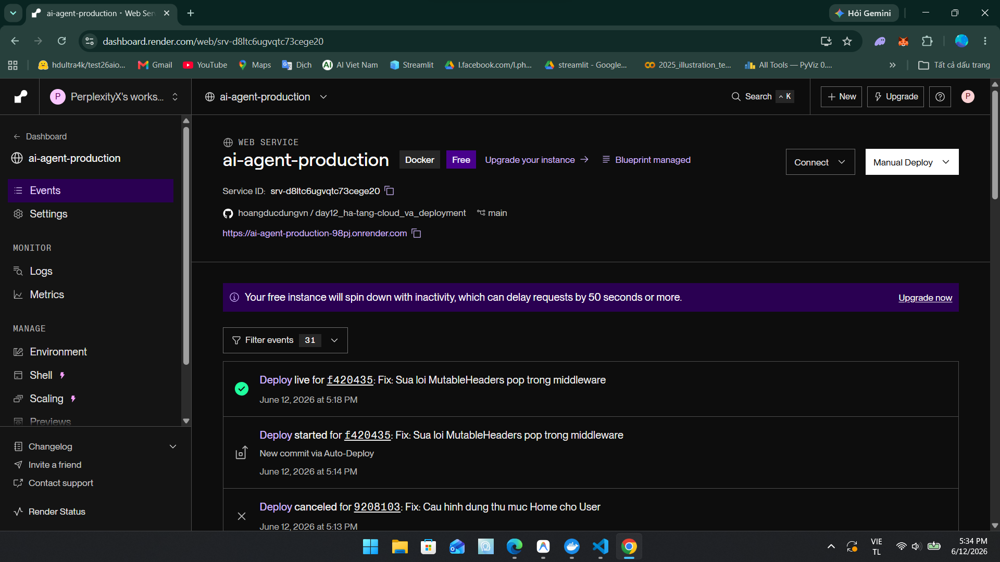
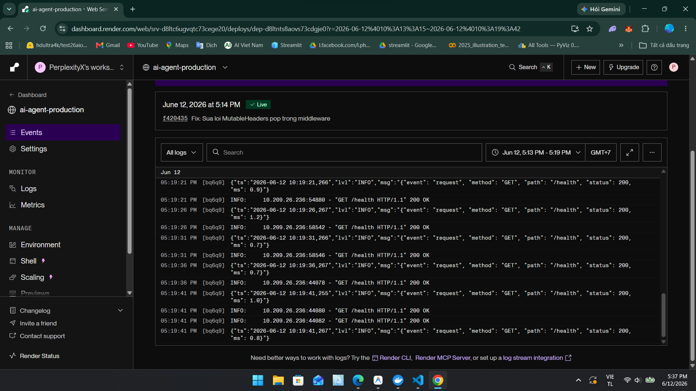
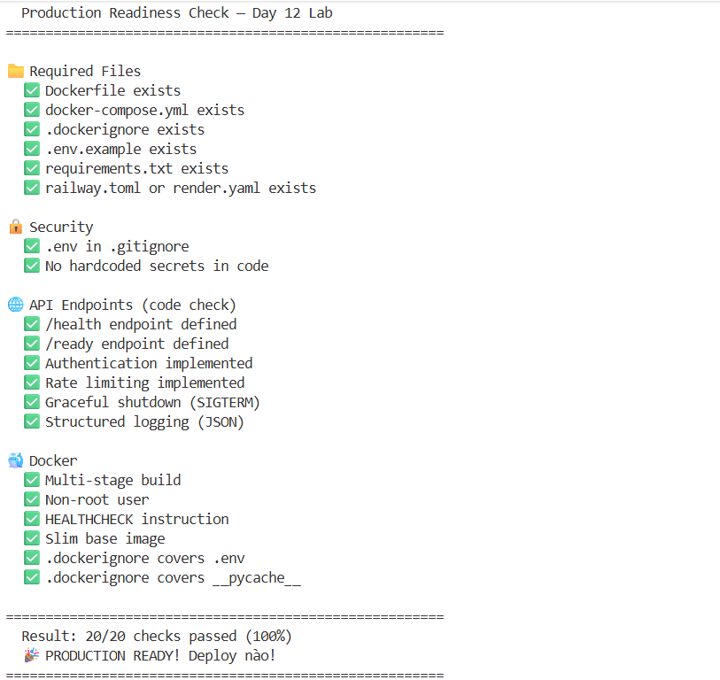
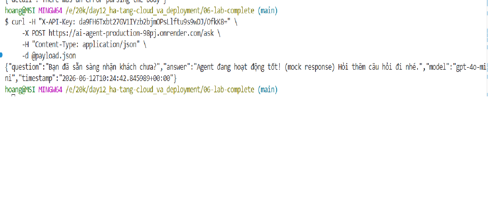

# Deployment Information

> **Student Name:** Hoàng Đức Dũng  
> **Student ID:** 2A202600814
> **Date:** 12/06/2026

## Public URL
https://ai-agent-production-98pj.onrender.com

## Platform
Render

## Test Commands

### Health Check
```bash
curl https://ai-agent-production-98pj.onrender.com/health
# Expected: {"status": "ok", ...}
```

### API Test (with authentication)
```bash
curl -X POST https://ai-agent-production-98pj.onrender.com/ask \
  -H "X-API-Key: da9FH6Txbt27GV1IYzb2bjmOPsLlftu9s9wDJ/OfkK8=" \
  -H "Content-Type: application/json" \
  -d "{\"question\": \"Hello\"}"
```

## Environment Variables Set
- `ENVIRONMENT=production`
- `APP_VERSION=1.0.0`
- `OPENAI_API_KEY`
- `AGENT_API_KEY` (Auto-generated by Render) #da9FH6Txbt27GV1IYzb2bjmOPsLlftu9s9wDJ/OfkK8=
- `JWT_SECRET` (Auto-generated by Render)
- `DAILY_BUDGET_USD=5.0`
- `RATE_LIMIT_PER_MINUTE=20`

## Screenshots
- [x] Deployment dashboard
  
- [x] Service running
  
- [x] Test results
  
  

##  Pre-Submission Checklist

- [x] Repository is public (or instructor has access)
- [x] `MISSION_ANSWERS.md` completed with all exercises
- [x] `DEPLOYMENT.md` has working public URL
- [x] All source code in `app/` directory
- [x] `README.md` has clear setup instructions
- [x] No `.env` file committed (only `.env.example`)
- [x] No hardcoded secrets in code
- [x] Public URL is accessible and working
- [x] Screenshots included in `screenshots/` folder
- [x] Repository has clear commit history

---

##  Self-Test

Before submitting, verify your deployment:

```bash
# 1. Health check
curl https://ai-agent-production-98pj.onrender.com/health

# 2. Authentication required
curl -X POST https://ai-agent-production-98pj.onrender.com/ask \
  -H "Content-Type: application/json" \
  -d "{\"question\":\"Hello\"}"
# Should return 401 Unauthorized

# 3. With API key works
curl -X POST https://ai-agent-production-98pj.onrender.com/ask \
  -H "X-API-Key: YOUR_KEY" \
  -H "Content-Type: application/json" \
  -d "{\"question\":\"Hello\"}"
# Should return 200 OK

# 4. Rate limiting
for i in {1..25}; do 
  curl -s -X POST https://ai-agent-production-98pj.onrender.com/ask \
    -H "X-API-Key: YOUR_KEY" \
    -H "Content-Type: application/json" \
    -d "{\"question\":\"test\"}"; 
done
# Should eventually return 429 Too Many Requests
```
